<div align="center">


# Alpha Financial App

### AI-Assisted Personal Finance Experience Built with Flutter

[](https://flutter.dev)
[](https://dart.dev)


**A bilingual Flutter mobile application that brings expense tracking, financial planning, savings goals, receipt processing, voice interaction, and AI-assisted financial services into one experience.**

[Overview](#overview) • [Features](#key-features) • [My Contribution](#my-contribution) • [Screenshots](#screenshots) • [Architecture](#architecture)

</div>

> **Portfolio showcase:** This public repository presents the product and my Flutter contribution. The complete team source code is intentionally not published here.

## Overview

Alpha helps users organize daily financial activity, plan income and savings, track goals, and understand their financial position through a unified mobile experience.

### The Product at a Glance

| User Need | Alpha Experience |
| --- | --- |
| Organize everyday spending | Expense creation, categorization, transaction views, and visual analytics |
| Plan income responsibly | Guided allocation across expenses, savings, goals, and financial cycles |
| Reduce manual entry | Receipt capture and voice-assisted expense input |
| Understand financial health | Dashboard summaries, analysis, notifications, and AI-assisted guidance |
| Use the app comfortably | Arabic/English localization, RTL support, and light/dark themes |

Alpha was developed as a multidisciplinary team project involving **Flutter, Backend, and AI development**. My responsibility was the **Flutter mobile application and service integration**.

## Key Features

- Account registration, login, OTP verification, and password recovery
- Multi-step personal and financial onboarding
- Expense creation, categorization, and analytics
- Financial-cycle management and dashboard summaries
- Income, fixed-expense, variable-expense, and savings planning
- Financial goals with target amounts, dates, priorities, and planned contributions
- Receipt capture and receipt-analysis workflow
- Voice-assisted expense input and speech-to-text interaction
- AI-backed financial assistant integrated through backend services
- Financial analysis with audio playback support
- In-app financial notifications and unread-state handling
- Arabic and English localization with RTL support
- Light and dark themes with locally persisted preferences

## My Contribution

I worked on Alpha as a **Flutter Developer**. My work focused on the mobile application rather than the backend or AI model development.

My responsibilities included:

- Designing and implementing Flutter screens and user flows
- Building reusable widgets and maintaining a consistent mobile UI
- Managing application state using **Provider / ChangeNotifier**
- Integrating Flutter features with the team's **REST APIs**
- Connecting authentication, OTP, expenses, goals, profile, financial-cycle, notification, chat, receipt, and analysis flows to backend services
- Handling loading, validation, success, and error states in the mobile experience
- Implementing navigation across authentication, onboarding, dashboard, expenses, goals, AI assistant, and profile flows
- Implementing Arabic/English localization and RTL behavior
- Implementing light/dark theme support and persistent user preferences
- Integrating speech-to-text, camera/gallery input, receipt workflows, and audio playback on the Flutter side
- Collaborating with Backend and AI team members during API and feature integration
- Using Git and GitHub for collaborative development

### Contribution Scope

| Area | Responsibility |
| --- | --- |
| Flutter UI & mobile experience | **My contribution** |
| Flutter state management | **My contribution** |
| REST API integration in Flutter | **My contribution** |
| Navigation & frontend workflows | **My contribution** |
| Localization & theming | **My contribution** |
| Backend development | Team member |
| AI model / AI backend development | Team member |

The backend services and AI implementation were developed by other members of the team. My role was to integrate those capabilities into the Flutter application.

## Tech Stack

### Mobile
- Flutter
- Dart

### State Management
- Provider
- ChangeNotifier

### Backend Integration
- REST APIs
- Dart `http`
- JSON response mapping
- Access-token and refresh-token handling

### Local Persistence
- SharedPreferences

### Localization
- easy_localization
- Arabic / English
- RTL support

### Media & Interaction
- image_picker
- camera
- speech_to_text
- record
- just_audio

### UI & Visualization
- fl_chart
- percent_indicator
- google_fonts
- table_calendar
- smooth_page_indicator
- pinput

### Receipt Processing
- google_mlkit_text_recognition
- Camera/gallery receipt input
- Backend receipt-analysis integration

### Development
- Git
- GitHub

## Architecture

The Flutter application uses a practical layered structure with **Provider-based state management**.

```text
Screens / Widgets
       │
       ▼
Providers
(ChangeNotifier)
       │
       ▼
Services
(API / Auth / Chat / Receipt)
       │
       ▼
REST Backend
       │
       ├── Financial Services
       └── AI-backed Services
```

Screens and widgets handle presentation and user interaction. Providers hold feature state and coordinate asynchronous operations. Service classes isolate external communication such as authentication, general API requests, chat, dashboard data, and receipt processing. Models represent structured application data.

This keeps most networking and feature state outside the UI layer without overstating the project as Clean Architecture or another pattern it does not formally implement.

## Project Structure

```text
flutter/
├── assets/
│   ├── images/
│   └── translations/
│
└── lib/
    ├── config/
    ├── core/
    ├── media/
    ├── models/
    ├── providers/
    ├── screens/
    │   ├── ai_assistant/
    │   ├── analysis/
    │   ├── auth/
    │   ├── challenges/
    │   ├── expenses/
    │   ├── goals/
    │   ├── home/
    │   ├── incomes/
    │   ├── notifications/
    │   ├── onboarding/
    │   ├── planning/
    │   ├── profile/
    │   ├── receipts/
    │   ├── transactions/
    │   └── voice/
    ├── services/
    ├── widgets/
    └── main.dart
```

## Screenshots

### Authentication

<table>
  <tr>
    <td align="center"><strong>Login</strong></td>
    <td align="center"><strong>Create Account</strong></td>
    <td align="center"><strong>OTP Verification</strong></td>
    <td align="center"><strong>Forgot Password</strong></td>
  </tr>
  <tr>
    <td>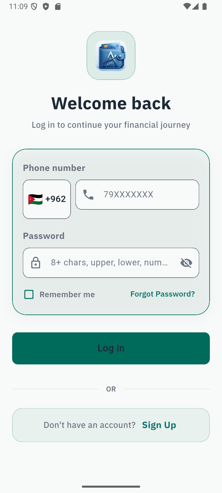</td>
    <td>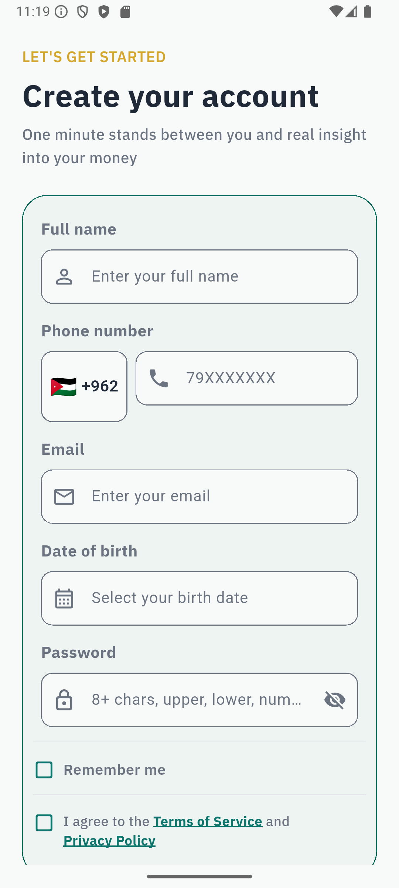</td>
    <td>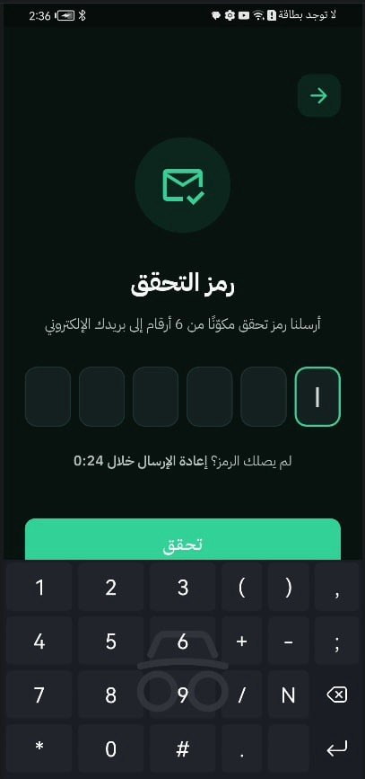</td>
    <td>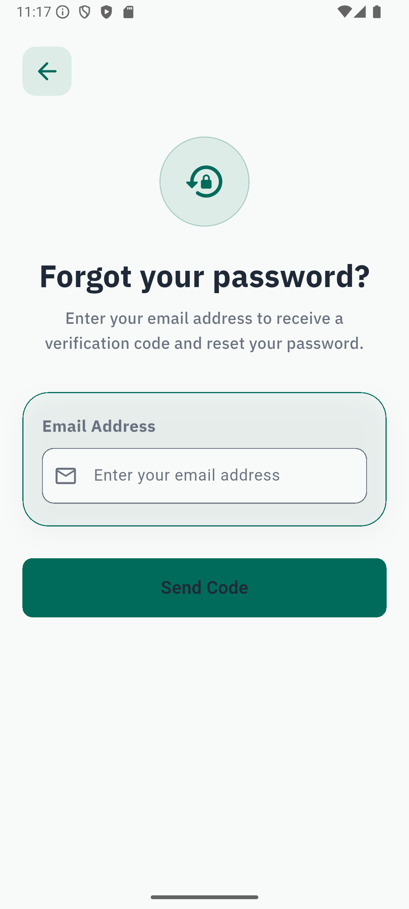</td>
  </tr>
</table>

### Financial Experience

<table>
  <tr>
    <td align="center"><strong>Home Dashboard</strong></td>
    <td align="center"><strong>Financial Onboarding</strong></td>
    <td align="center"><strong>Income Distribution</strong></td>
  </tr>
  <tr>
    <td>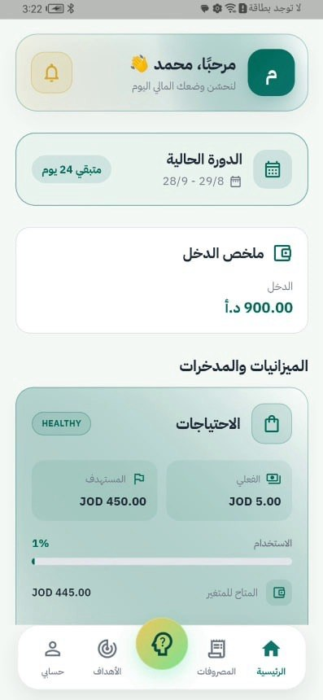</td>
    <td>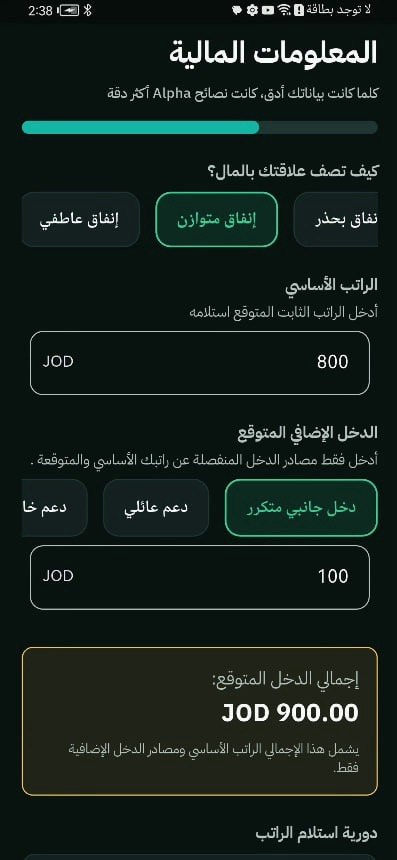</td>
    <td>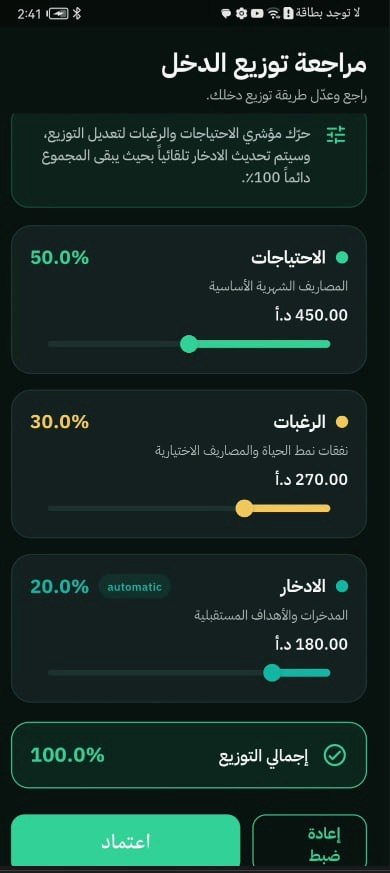</td>
  </tr>
</table>

### Expenses & Goals

<table>
  <tr>
    <td align="center"><strong>Expense Analytics</strong></td>
    <td align="center"><strong>Savings Planning</strong></td>
    <td align="center"><strong>Add Financial Goal</strong></td>
  </tr>
  <tr>
    <td>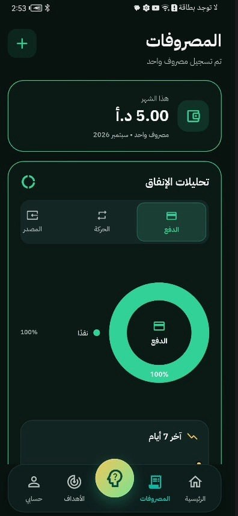</td>
    <td>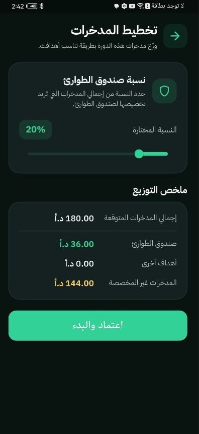</td>
    <td>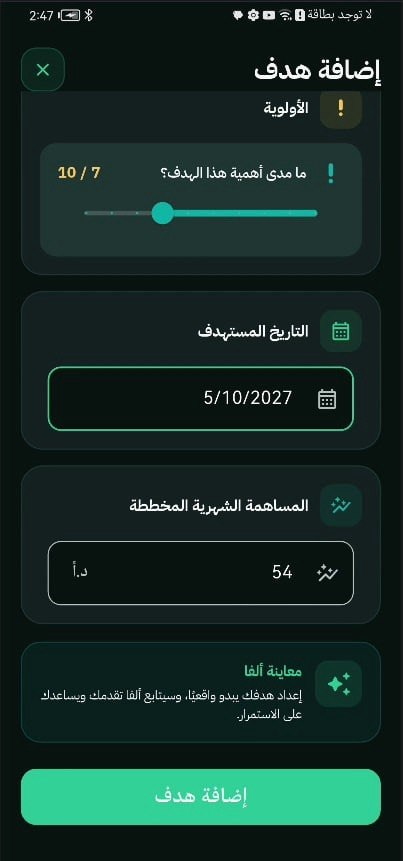</td>
  </tr>
</table>

### Smart Features

<table>
  <tr>
    <td align="center"><strong>Receipt Scanner</strong></td>
    <td align="center"><strong>Voice Expense Entry</strong></td>
    <td align="center"><strong>AI Assistant</strong></td>
  </tr>
  <tr>
    <td>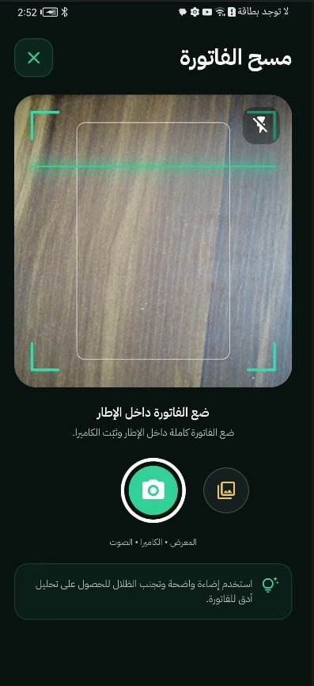</td>
    <td>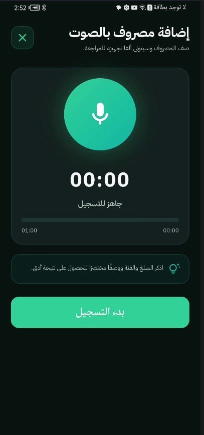</td>
    <td>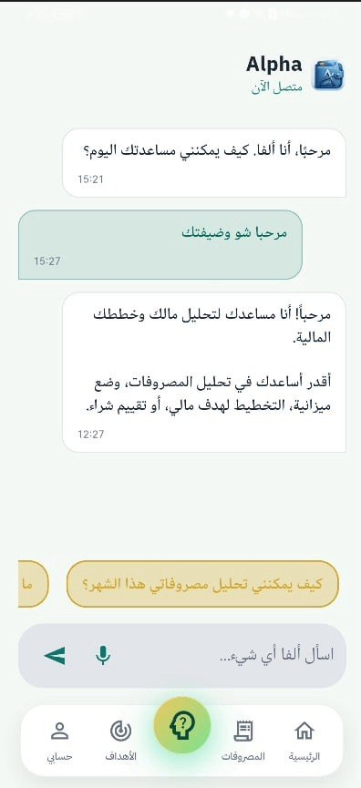</td>
  </tr>
</table>

### Analysis & Profile

<table>
  <tr>
    <td align="center"><strong>Financial Analysis</strong></td>
    <td align="center"><strong>Profile</strong></td>
  </tr>
  <tr>
    <td>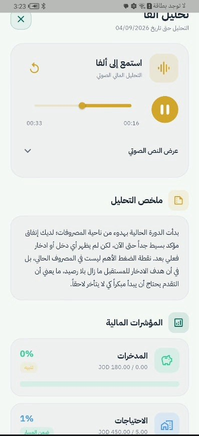</td>
    <td>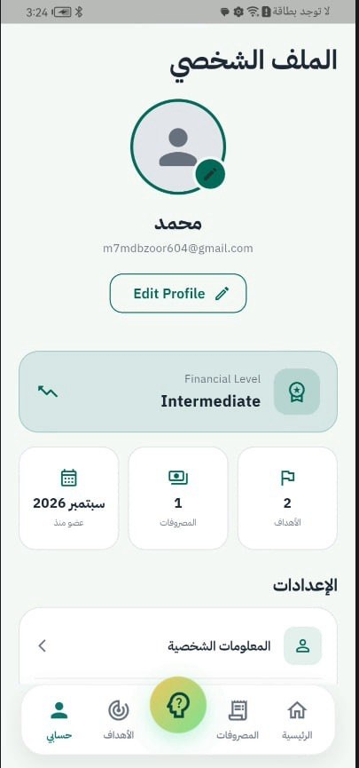</td>
  </tr>
</table>

## Technical Highlights

From a Flutter-development perspective, this project demonstrates:

- Multi-feature Flutter application development
- Provider-based state management across multiple domains
- REST API integration across authentication and financial workflows
- Token-based session handling and refresh-token support
- Multi-step onboarding and guarded application flows
- Forms, validation, and asynchronous UI states
- Arabic localization and RTL UI
- Local persistence for application preferences
- Speech-to-text integration
- Camera and gallery workflows
- Receipt-processing integration
- Audio playback
- Financial data visualization
- Team-based frontend/backend integration

## Source Code

This repository is intentionally maintained as a **public portfolio showcase**.

The complete production repository contains work from multiple team members and is therefore not published here as my individual source code. This showcase focuses on the product, the Flutter architecture, and the parts I was responsible for implementing and integrating.

## Future Improvements

- Expand automated widget and integration testing
- Add CI/CD for Flutter analysis and build verification
- Improve offline caching for selected financial data
- Strengthen accessibility and semantic-label testing
- Continue breaking larger feature providers into smaller, more focused units as the application grows

## Author

**Mariam — Flutter Developer**

GitHub: [@mariamsawwa12](https://github.com/mariamsawwa12)

**Project Type:** Team Project  
**Primary Focus:** Flutter UI, State Management, REST API Integration, Localization & Mobile UX
